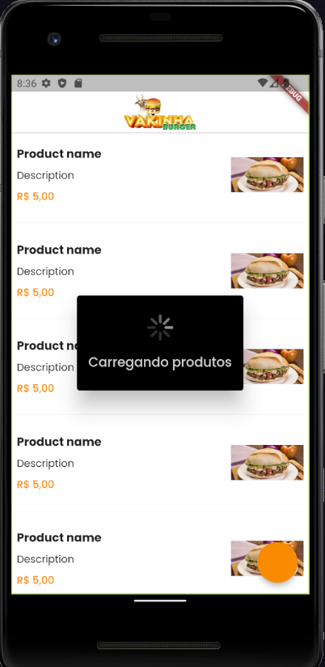
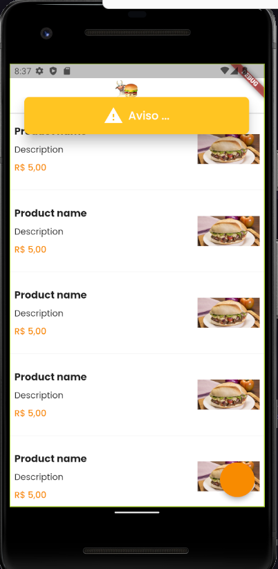
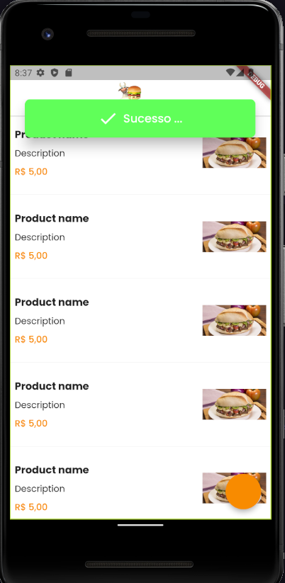
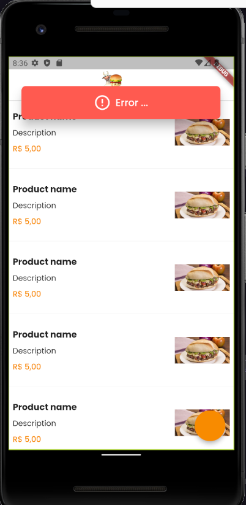

# IBurger

A new Flutter project.

## Getting Started

This project is a starting point for a Flutter application.

A few resources to get you started if this is your first Flutter project:

- [Lab: Write your first Flutter app](https://docs.flutter.dev/get-started/codelab)
- [Cookbook: Useful Flutter samples](https://docs.flutter.dev/cookbook)

For help getting started with Flutter development, view the
[online documentation](https://docs.flutter.dev/), which offers tutorials,
samples, guidance on mobile development, and a full API reference.

# Run local server 
1° - Active the Json Rest Server from pub
```
dart pub global activate json_rest_server
```
2° - Run server from json_api folder 
```
json_rest_server run

```

# Run build_runner
```
dart run build_runner watch -d
```

# Some states for show messages and loadings
- All of them was implemented with native flutter component, therefore, I have not used dependecy to show them.
<br></br>
<div align="center">
    
    
    
    
</div>

# See some of Animations that there is on APP
<br></br>
<div align="center">
    <video src="https://user-images.githubusercontent.com/63085711/226089369-cfe08382-4f39-4757-81e6-312675ee0223.mp4" height="600px" controls>
</div>

# Insights
 - CustomScrollView with SliverFillRomain()
 - Stack for postion fix children into row (decrement qtd increment)
 - Creation of components by extends Widget using super to implements the widget
 - extensions for context, example, get textStyle from context as singleton
 - ValueNotifier to update just one part of screen by some variable type

 ```
SliverAppBar: This sliver renders an app bar, and it is one of the most commonly used sliver widgets that creates collapsible AppBars by setting both the flexibleSpace and expandedHeight parameters

SliverList: A sliver that renders a list in a linear array along the ScrollView’s main axis. To build list items as they scroll into view, SliverList accepts a delegate parameter. A SliverChildListDelegate specifies the fixed list of children that are created all at once, whereas a SliverChildBuilderDelegate specifies how they are built lazily

SliverFixedExtentList: SliverFixedExtentList is identical to SliverList, with the exception that SliverFixedExtentList guarantees that all list items will have the same size on the main axis (i.e., equal height on a vertical scrolling list or equal width on a horizontal scrolling list). This has a significant impact on the performance of the ListView when scrolling because knowing the size of the items before loading them is quite beneficial when you wish to jump a long distance. For example, if we know each item is fixed at 50px tall and we want to scroll 5,000px down, we can easily leap 100 things by loading the 101st item and displaying it

SliverGrid: SliverGrid is a sliver that displays a 2D array of children in a ScrollView. It accepts children via a delegate or an explicit list, and it also defines gridDelegate, which determines the location of the children widget within the grid

SliverPadding: A sliver that creates empty space around another sliver. The only difference between it and the Padding widget is that it generates RenderSliver rather than RenderBox, so that it can be used inside CustomScrollView

SliverToBoxAdapter: A sliver that allows you to warp any other widget that isn’t a Sliver and use it inside CustomScrollView; this is a very useful sliver for creating intricate scrolling screens with various widgets

SliverOpacity: A sliver widget that makes its sliver child partially transparent. It is an easy-to-use replacement to the Opacity widget, just like SliverPadding

SliverFillRemaining: ?

From: https://blog.logrocket.com/building-custom-flutter-scrollview/
 ```
